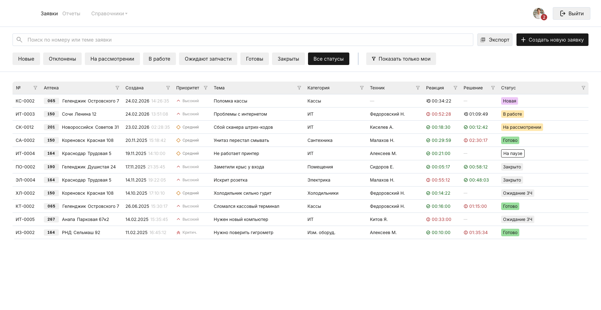
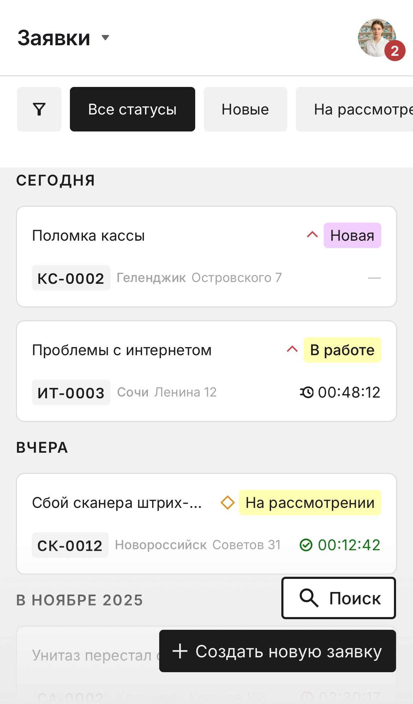
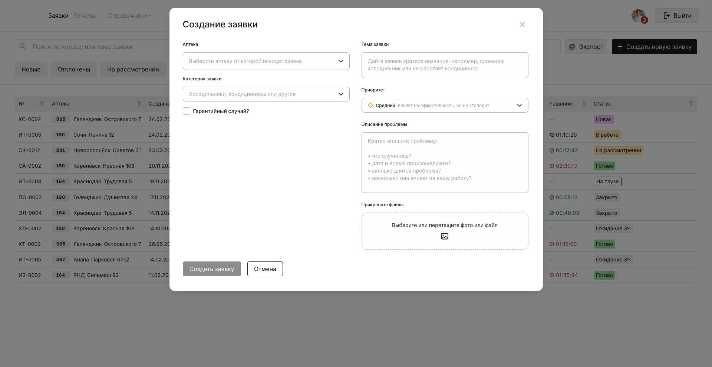
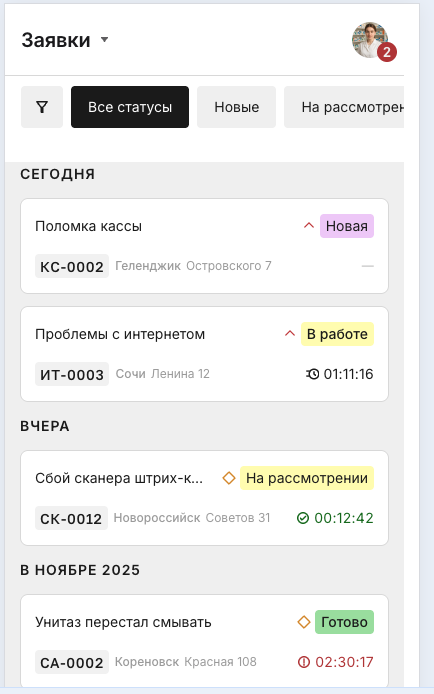

# Aiston Test Task Frontend

Реализация тестового задания по верстке и базовой интерактивности экрана заявок по макету Figma: адаптивные desktop/mobile экраны, табы, создание заявки через модалку, фильтрация/поиск по таблице и состояния загрузки.

## Ссылки

- Репозиторий: [DenisChernykh/aiston-test-task](https://github.com/DenisChernykh/aiston-test-task)
- Макет Figma: [Тестовое задание Frontend](https://www.figma.com/design/GjDSK9UrOocDmrAwk3dS00/%D0%A2%D0%B5%D1%81%D1%82%D0%BE%D0%B2%D0%BE%D0%B5-%D0%B7%D0%B0%D0%B4%D0%B0%D0%BD%D0%B8%D0%B5-Frontend--Copy-?node-id=0-1&p=f&t=M4rSO16fG6smfNOV-0)

## Стек

- React 19 + TypeScript
- Vite 7
- Chakra UI 3
- react-hook-form + zod (валидация формы)
- date-fns (форматирование дат)

## Запуск

```bash
pnpm install
pnpm dev
```

Приложение по умолчанию доступно на `http://localhost:5173`.

Production-сборка и превью:

```bash
pnpm build
pnpm preview
```

## Скрипты

| Команда | Назначение |
| --- | --- |
| `pnpm dev` | Запуск dev-сервера Vite |
| `pnpm build` | TypeScript-check + production build |
| `pnpm preview` | Локальный просмотр production build |
| `pnpm lint` | Проверка ESLint |
| `pnpm format` | Форматирование Prettier |
| `pnpm format:check` | Проверка форматирования |
| `pnpm chakra:typegen` | Генерация Chakra type tokens |

## Чеклист требований

### 1. Верстка desktop/mobile на Chakra UI — ✅
- Файлы:
  - [`src/pages/requests/ui/requests-page.tsx`](src/pages/requests/ui/requests-page.tsx)
  - [`src/widgets/header/ui/header.desktop.tsx`](src/widgets/header/ui/header.desktop.tsx)
  - [`src/widgets/header/ui/header.mobile.tsx`](src/widgets/header/ui/header.mobile.tsx)
  - [`src/widgets/requests-table/ui/requests-table.desktop.tsx`](src/widgets/requests-table/ui/requests-table.desktop.tsx)
  - [`src/widgets/requests-table/ui/requests-table.mobile.tsx`](src/widgets/requests-table/ui/requests-table.mobile.tsx)
- Комментарий: раздельные представления для брейкпоинтов `base/md`.

### 2. Адаптивность и отзывчивость — ✅
- Файлы:
  - [`src/shared/config/theme/system.ts`](src/shared/config/theme/system.ts)
  - [`src/widgets/requests-toolbar/ui/requests-toolbar.tsx`](src/widgets/requests-toolbar/ui/requests-toolbar.tsx)
- Комментарий: кастомные токены/размеры и mobile floating-actions.

### 3. Переключение по табам — ✅
- Файл: [`src/features/request-filters/ui/request-status-tabs.tsx`](src/features/request-filters/ui/request-status-tabs.tsx)
- Комментарий: табы статусов + отдельный порядок на mobile.

### 4. Создание заявки через модалку — ✅
- Файлы:
  - [`src/features/request-create/ui/request-create-modal.tsx`](src/features/request-create/ui/request-create-modal.tsx)
  - [`src/features/request-create/ui/request-create-modal.desktop.tsx`](src/features/request-create/ui/request-create-modal.desktop.tsx)
  - [`src/features/request-create/ui/request-create-modal.mobile.tsx`](src/features/request-create/ui/request-create-modal.mobile.tsx)
- Комментарий: `Dialog` на desktop, `Drawer` на mobile.

### 5. Select с моковыми данными в модалке — ✅
- Файлы:
  - [`src/features/request-create/ui/request-native-select-field.tsx`](src/features/request-create/ui/request-native-select-field.tsx)
  - [`src/features/request-create/model/use-request-create-form-options.ts`](src/features/request-create/model/use-request-create-form-options.ts)
  - [`src/entities/request/api/request-db.mock.ts`](src/entities/request/api/request-db.mock.ts)
- Комментарий: данные аптек/категорий/приоритетов из mock API.

### 6. Подгрузка фотографий/файлов — ✅
- Файлы:
  - [`src/features/request-create/ui/request-create-files-field.desktop.tsx`](src/features/request-create/ui/request-create-files-field.desktop.tsx)
  - [`src/features/request-create/ui/request-create-files-field.mobile.tsx`](src/features/request-create/ui/request-create-files-field.mobile.tsx)
- Комментарий: drag-and-drop на desktop, attach-кнопка на mobile.

### 7. Кнопка «Создать»: закрытие модалки и лог в консоль — ✅
- Файл: [`src/features/request-create/model/use-request-create-modal-controller.ts`](src/features/request-create/model/use-request-create-modal-controller.ts)
- Комментарий: лог `createRequestDraft` + закрытие и reset формы.

### 8. Фильтрация таблицы (доп. улучшение) — ✅
- Файлы:
  - [`src/widgets/requests-table/model/use-requests-table-view-model.ts`](src/widgets/requests-table/model/use-requests-table-view-model.ts)
  - [`src/features/request-filters/ui/request-filters-row.tsx`](src/features/request-filters/ui/request-filters-row.tsx)
  - [`src/features/request-search/ui/request-search-field.tsx`](src/features/request-search/ui/request-search-field.tsx)
- Комментарий: статус, «только мои», поиск по номеру/теме.

### 9. Hover/focus/active эффекты — ✅
- Файл: [`src/shared/config/theme/recipes/button.recipe.ts`](src/shared/config/theme/recipes/button.recipe.ts)
- Комментарий: состояния кнопок и интерактивных элементов.

### 10. Loading/empty/error состояния — ✅
- Файлы:
  - [`src/widgets/requests-table/ui/requests-table.loading.tsx`](src/widgets/requests-table/ui/requests-table.loading.tsx)
  - [`src/widgets/requests-table/ui/requests-table.empty.tsx`](src/widgets/requests-table/ui/requests-table.empty.tsx)
  - [`src/widgets/requests-table/ui/requests-table.error.tsx`](src/widgets/requests-table/ui/requests-table.error.tsx)
- Комментарий: добавлены скелетоны, пустые и error-экраны.

### 11. Моковые данные — ✅
- Файл: [`src/entities/request/api/request-db.mock.ts`](src/entities/request/api/request-db.mock.ts)
- Комментарий: локальная база заявок + опции формы.

## Скриншоты

### Desktop: основной экран



### Mobile: основной экран



### Desktop: модалка создания заявки



### Mobile: основной экран



## Проверка сценариев

1. Открыть `http://127.0.0.1:4173/` и проверить desktop/mobile UI (через DevTools responsive mode).
2. Переключать табы статусов и toggle «Показать только мои», проверить фильтрацию таблицы.
3. Ввести текст в поиск, убедиться в фильтрации по номеру и теме.
4. Нажать «Создать новую заявку», заполнить поля, прикрепить файл и отправить форму.
5. После клика «Создать заявку» проверить:
   - модалка закрылась,
   - в консоли браузера появился лог `createRequestDraft`.
6. Проверить мок-состояния данных по URL:
   - `http://127.0.0.1:4173/?requestsState=empty`
   - `http://127.0.0.1:4173/?requestsState=error`
   - `http://127.0.0.1:4173/?createRequestState=empty`
   - `http://127.0.0.1:4173/?createRequestState=error`

## Известные расхождения

- Критичных расхождений верстки с макетом Figma в реализованных сценариях не выявлено.
- Даты части строк в таблице генерируются динамически от текущего времени (через `createMockDate`), поэтому значения могут отличаться от статичного скриншота в макете.
- Иконки фильтра в заголовках desktop-таблицы реализованы как визуальный элемент (без сортировки по клику), так как сортировка не входила в обязательные требования.
